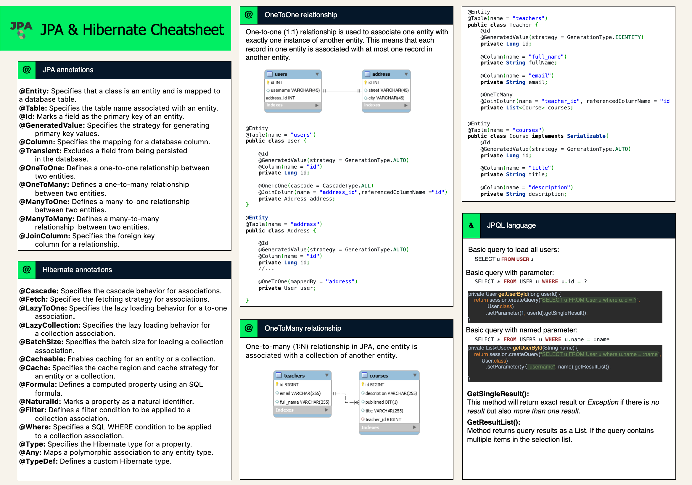

# JPA - JAva Persistent API
JPA stands for *Java Persistence API*. It is a Java specification for managing, persisting, and accessing data between Java objects and relational databases. JPA provides a standard way to map Java objects to database tables and vice versa, allowing developers to interact with databases using a set of standard Java classes and annotations.

*Key features of JPA include:*

1. **Object-Relational Mapping (ORM):** JPA allows developers to represent database tables as Java objects and vice versa, providing a seamless way to interact with databases using Java classes.

2. **Entity:** In JPA, an entity is a persistent domain object, typically representing a row in a database table. Entities are annotated with `@Entity` to indicate their persistence.

3. **EntityManager:** The `EntityManager` is a key interface in JPA that provides methods for interacting with the persistence context. It is responsible for managing the lifecycle of entities, including persisting, updating, and removing them.

4. **JPQL (Java Persistence Query Language):** JPA includes a query language called JPQL, which is similar to SQL but operates on Java entities rather than database tables. JPQL allows developers to write queries in a database-agnostic way.

5. **Annotations:** JPA uses annotations to define the mapping between Java objects and database tables. Annotations like `@Entity`, `@Id`, `@Column`, and others are used to specify the mapping details.

6. **Transaction Management:** JPA supports transaction management, ensuring that multiple database operations can be grouped into a single transaction, and they either all succeed or all fail.

7. **Persistence Unit:** A persistence unit is a logical grouping of entities and their configuration in JPA. It is defined in a `persistence.xml` or `hibernate.cfg.xml` file and specifies the properties and entities associated with a particular database.

JPA is a part of the Java EE (Enterprise Edition *up to Java 1.8*) and Jakarta EE specifications. It simplifies database access in Java applications and promotes a standardized approach to data persistence across different Java EE applications.

